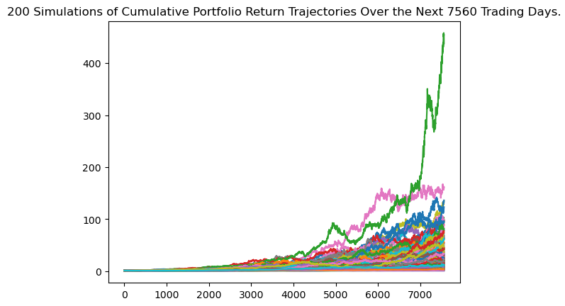

# Assessing Highest Sharpe Ratio Portfolio Performance
## Would a portfolio comprised of selected stocks based on Sharpe Ratios outperform its benchmark?

### Using the Sharpe Ratio to select a stock portfolio has some significant limitations. These include: selecting the right historical timeframe used to calculate Sharpe Ratios and availability of historical data. We found that using a Monte Carlo Simulation based on the highest Sharpe Ratio stocks from each sector produced extreme outlier results that are likely due to our historical data being limited to the single longest bull market on record. We beleive this created a significant and unrealistic bias toward high performing returns.

## How do we identify the top Sharpe Ratio stock from each sector?
### Organize the data frame to be sorted by best ratios and use 'groupby' function to determine the top performing stock in each sector.

## How do we assess this portfolio’s performance?
### Select a benchmark to gauge the results of our Sharpe Ratio portfolio. We diversified our stock selection by representing each sector with its highest Sharpe Ratio stock.

## What method(s) should we use to predict performance?
### Monte Carlo Simulations were used to project hundreds of possible outcomes of cumulative returns for both the Sharpe Ratio Portfolio and our benchmark, the 'SPY' ETF. We found a significant difference in the outcomes that place doubt on the reliability of our outcomes for real-life portfolio stock selections.

